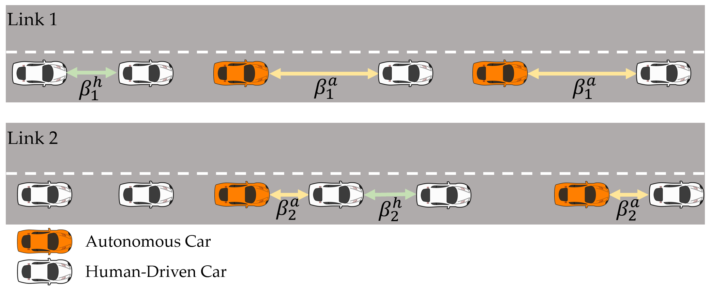

# RL-Traffic-Dynamics

[](https://opensource.org/licenses/MIT)
 


## Overview
This is the public code repo for the paper at ICRA 2023 London , [Learning to Influence Vehicles' Routing in Mixed-Autonomy Networks by Dynamically Controlling the Headway of Autonomous Cars](https://arxiv.org/abs/2303.04266), by Xiaoyu Ma and Prof. Negar Mehr from University of Illinois at Urbana-Champaign.




<p float="left">
  
   
</p>

The repository include necessary files for running the RL_headway_dynamics project in the classic Braess network. A jupyter notebook is also included for demonstration purpose.

## Local Implementation

```gym-traffic/gym_traffic/envs``` contains the defined traffic model


run ```python3 gym-traffic/main.py``` for RL algorithms

### Required packages
torch, gym, stable_baselines3, wandb

Please register the env file as a self-defined env in gym to utilize the code if only using the .py files for executing before running the runner.py

## Jupyter Notebook Implementation
Without registering the env, you can run the notebook in any Linux environment or online server interface (Google CoLab for instance).
